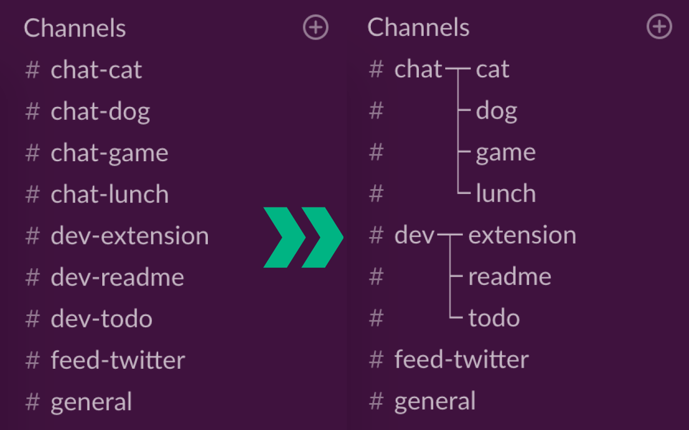

# Slack Channels Grouping

Grouping slack channels.




## Install

- Chrome: [Slack Channels Grouping - Chrome Web Store](https://chrome.google.com/webstore/detail/slack-channels-grouping/lcbnhfianneihfgkmfncnhpkpghedbkm)
- Firefox: [Slack Channels Grouping – Firefox Add-ons](https://addons.mozilla.org/ja/firefox/addon/slack-channels-grouping/)

# Dev
- Node.js v8.15.0

## Install
```
$ yarn install
```

## Development
```
yarn dev chrome
yarn dev firefox
yarn dev opera
yarn dev edge
```

## Build
```
yarn build chrome
yarn build firefox
yarn build opera
yarn build edge
```

## Environment

The build tool also defines a variable named `process.env.NODE_ENV` in your scripts.

## Docs

* [webextension-toolbox](https://github.com/HaNdTriX/webextension-toolbox)
